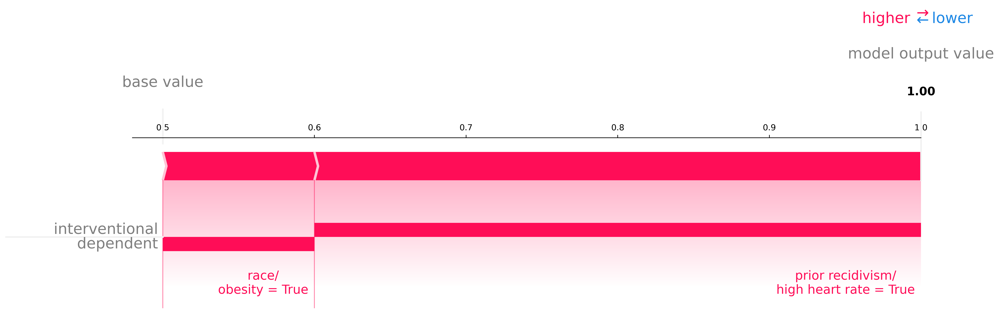
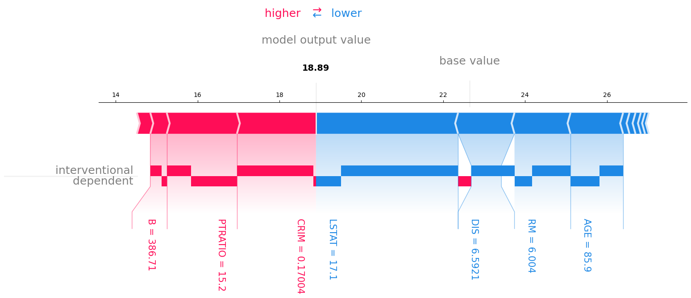

# Decomposition SHAP

_Code accompanying [Explaining the Model and Feature Dependencies by Decomposition of the Shapley Value](placeholder)._

SHAP values have become increasingly popular in recent years. However, it is (was) unclear how to apply them to datasets
with dependent features. In our paper we provide a summary of the different options that arise and their
motivations. Essentially, two popular SHAP implementations exist with followers on both sides: one that explains the
model (Interventional SHAP [[1]](#1), the regular [shap](https://github.com/shap/shap) implementation) and one that
explain the model combined with the feature dependencies (Conditional SHAP [[2]](#2)). We will illustrate that both
options are
valuable for different inferences with a simple example. Consider two binary dependent features $X_1$ and $X_2$, and
a model which output is equal to the first feature, $f([X_1,X_2]) = X_1$. Now consider two different fictive settings:

|              |      $X_1$      |  $X_2$  |    $f(\cdot)$     | Interventional SHAP |  Conditional SHAP  | Decomposition SHAP | 
|:------------:|:---------------:|:-------:|:-----------------:|:-------------------:|:------------------:|:------------------:|
|  **court**   |   recidivist    |  race   | future recidivism | :heavy_check_mark:  |                    | :heavy_check_mark: |
| **hospital** | high heart rate | obesity |   heart attack    |                     | :heavy_check_mark: | :heavy_check_mark: |

Given a certain sample, with SHAP we explain its output by determining what effect every feature value has towards
the output. In the first setting $f$ is an indicator for the future recidivism of a convict. A convict $\boldsymbol{x}$
can
demand an explanation of the algorithm involved in the courts decision. In this
case the explanation should attribute $f([\boldsymbol{x}_1,\boldsymbol{x}_2])$ entirely to $\boldsymbol{x}_1$,
showing absence of racial bias in the _model_. The second setting requires a different explanation. For patient
$\boldsymbol{x}$ with a high heart attack risk, a good explanation should attribute part of
$f([\boldsymbol{x}_1,\boldsymbol{x}_2])$ to $\boldsymbol{x}_2$, since changing $\boldsymbol{x}_2$ by losing weight
could decrease the heart rate, which in term reduces the odds of having a heart attack according to the model. Note
that this last attribution is solely due to the feature dependency.

Preferably, a good method should provide both inferences. Therefore, we propose to split up a SHAP value for a feature
into a model corresponding (interventional)
attribution and an attribution via other dependent features, allowing the end-user (e.g. convict or patient) to easily
grasp the explanation of _both_ the model and feature dependencies.

These attributions can be visualized through our
modified force plots. For the simple toy example above, we explain $f(X_1=1,X_2=1) =1$.



We see that the convict's race has no interventional effect. Whether the patient is obese does have an output effect via
its dependent feature _high heart rate_ which is clearly shown in the explanation.

Furthermore, we can apply our method to the standard Boston Housing dataset and explain the prediction of a random
forest
model.



We see that the crime rate per capita ($\mathit{CRIM}$) being 0.17004 has a big positive effect on the median house
price in this town, and the effect is largely interventional. This means that the $\mathit{CRIM}$ of this town has a
strong effect on
the output via its specific weights in the model. The pupil-teacher ratio $\mathit{PTRATIO}$ also has positive effect. A
significant part of this effect is through its dependent features: it influences the distributions of the dependent
features which in term increase the expected model output via their specific weights. We can also see that the model has
a small racial bias: the interventional part of $B$ is non-zero.

## Install instructions

- clone the Github respository
- install Conda environment (requires Conda): `conda env create -f environment.yml`

## Usage

Let's illustrate the use of our toolbox with an example. We will use the Breast Cancer Wisconsin dataset
and a XGBoost model to predict the cancer type. We will then explain the prediction of a test sample using
Decomposition SHAP. The full code is available in `example.py`.

First load the data and train the model:

```python
import numpy as np
import xgboost as xgb
from sklearn.datasets import load_breast_cancer
from sklearn.model_selection import train_test_split

from decomposition_shap.distributions import MultiGaussian
from decomposition_shap.force_dependent import force_dependent_plot
from decomposition_shap.kernel_dependent import DependentKernelExplainer

np.random.seed(0)

# Load Breast Cancer Wisconsin dataset
x, y = load_breast_cancer(return_X_y=True)
x_train, x_test, y_train, y_test = train_test_split(x, y, test_size=0.2)
    
# Fit a model
model = xgb.XGBClassifier(n_estimators=10)
model.fit(x_train, y_train)
```

Since we are computing data dependencies, an assumed data distribution is required. In this case we will use a
multivariate Gaussian distribution. We can now explain the prediction of a test sample:

```python
# Fit feature distribution (assumed Multivariate Gaussian)
dist = MultiGaussian(x_train)
# Note: custom distributions can also be defined see decomposition_shap/distribution.py

# Initialize explainer
explainer = DependentKernelExplainer(lambda d: model.predict(d, output_margin=True), x_train, dist.sample)
# Note: as with regular SHAP, usually it makes more sense to explain the logodds 'model.predict(d, output_margin=True)'
# instead of the class probabilities 'model.predict(d)'

# Explain the third test sample
sample_index = 3
shaps = explainer.shap_values(x_test[sample_index])  # returns array of conditional SHAP values + interventional effects
```

The SHAP values can be visualized using the `force_dependent_plot` function:

```python
data = load_breast_cancer()
# With link='logit' the logodds are shown under the axis, and the probability is shown above the axis
fig = force_dependent_plot(np.mean(model.predict(x_train)), shaps, features=x_test[sample_index],
                       feature_names=data['feature_names'], link='logit', text_rotation=-90)  # returns plt.gcf()
fig.savefig("example.png", bbox_inches="tight")
```


## Files and important functions

- `\decomposition_shap\kernel_dependent.py` holds functions that can compute interventional and dependent effects
    - class `DependentKernelExplainer` explains output of any function for any situation by decomposing the Shapley
      value into an interventional and dependent effect. See code documentation for information on constructor
      arguments.
    - function `shap_values(...)` estimates the SHAP values and interventional effects for a set of samples. See code
      documentation for information on arguments.
- `\decomposition_shap\force_dependent.py` holds implementation of force plot visualizations with interventional and dependent effects
    - function `force_dependent_plot(...)` visualizes the given SHAP values and interventional effects in a matplotlib
      force plot. See code documentation for information on arguments.
- `\decompostion_shap\distributions.py` holds different implementations of assumed data distributions
- `\experiments` has all code to do all experiments of the paper and generate all results
- `example.py` has a simple example to illustrate the use of Decomposition SHAP
- `tests` tests of the implemented code

## Citation

If you use Decomposition SHAP in your research we would appreciate
citing [Explaining the Model and Feature Dependencies by Decomposition of the Shapley Value](placeholder)

## References
<a id="1">[1]</a> 
Janzing, D., Minorics, L., & Blöbaum, P. (2020, June). Feature relevance quantification in explainable AI: A causal
problem. In International Conference on artificial intelligence and statistics (pp. 2907-2916). PMLR.

<a id="2">[2]</a> 
Aas, K., Jullum, M., & Løland, A. (2021). Explaining individual predictions when features are dependent: More
accurate approximations to Shapley values. Artificial Intelligence, 298, 103502.
